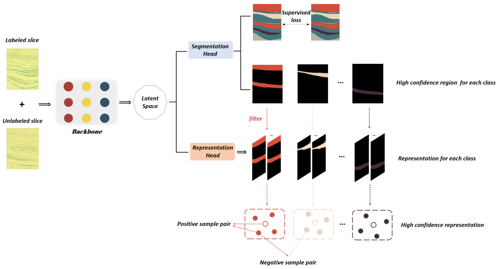
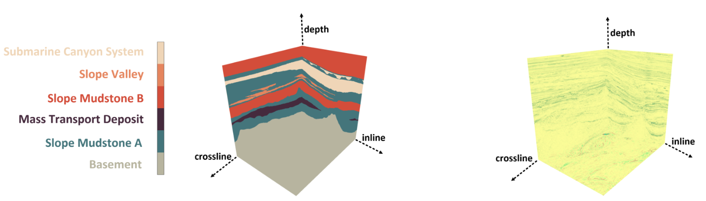
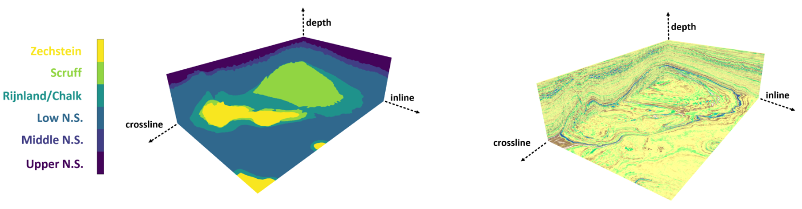
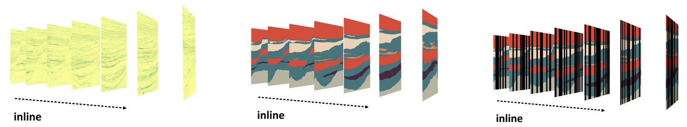
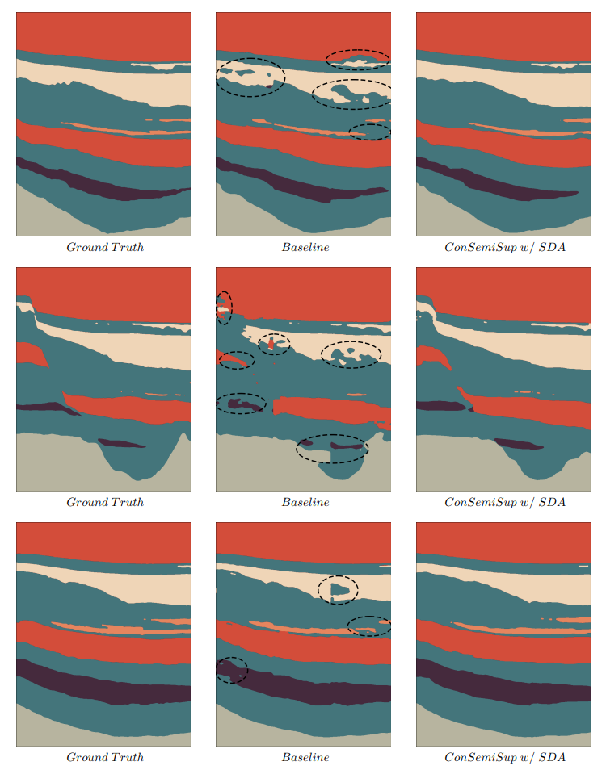
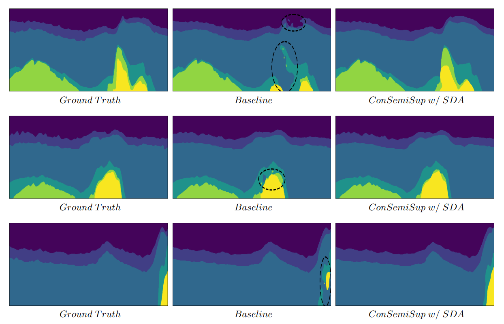

### Abstract

> The manual seismic facies annotation relies heavily on the experience of seismic interpreters, and the distribution of seismic facies in adjacent locations is very similar, which means that much of the labeling is costly repetitive work. However, we found that training the model with only a few evenly sampled labeled slices still suffers from severe classification confusion, that is, misidentifying one class of seismic facies as another. To address this issue, we propose a semi-supervised seismic facies identification method using features from unlabeled data for contrastive learning. We sample features in regions with high identification confidence, and use a pixel-level instance discrimination task to narrow the intra-class distance and increase the inter-class distance. Instance discrimination encourages the latent space to produce more distinguishable decision boundaries and reduces the bias in the features of the same class. Our method only needs to extend one branch to compute the contrastive loss without extensive changes to the network structure. We have conducted experiments on two public seismic surveys, SEAM AI and Netherlands F3, and  the proposed model achieves an IOU score of more than 90 using only 1% of the annotations in the F3 survey.



### Installation

Runing the following scripts in turn for installation and training.

```
git clone https://github.com/upcliuwenlong/CONSS.git && cd CONSS
pip install -r requirements.txt

# Fully supervised learning
python train_f3_sup.py
python train_seam_ai_sup.py

# Semi supervised learning
python train_f3_semi_sup.py
python train_seam_ai_semi_sup.py

# Inference
python predict_f3.py
python predict_seam_ai.py

# Evaluate
python evaluate_f3.py
python evaluate_seam_ai.py
```

### Seismic Surveys

- SEAM AI Survey
  
  The SEAM AI surveyt is large 3D seismic data provided by the New Zealand government that has been manually interpreted by geologists.The survey region  is in the Parihaka block of the Taranaka Basin off the northwest coast of New Zealand, and each pixel in the region is classified into one of the following six types of seismic facies.
  
  [Download Link](https://drive.google.com/drive/folders/1hvWpCGta3mrWVl4Ct44RqLSmbEb_JA-n?usp=sharing)
  
  

- Netherlands F3 Survey
  
  The complete seismic facies annotation is grounded in the geology of the Netherlands F3 Block and based on the study of both the 3D seismic data and 26 well logs located within the F3 block or its vicinity.
  
  [Download Link](https://drive.google.com/drive/folders/1SmrQ7BfpUFFMZugR3vo-tnfX69e_uLfo?usp=sharing)
  
  

### Slice sampling

The seismic data and corresponding labels are evenly sampled at equal step intervals as training data, and the step size is 100.



### Experiment Results

We give the results of ablation experiments and the weight of the model.

- SEAM AI Survey
  
  | Method                  | MCA   | FWIOU | MIOU           | F1    | CHECKPOINTS                                                                                        |
  | ----------------------- | ----- | ----- | -------------- | ----- | -------------------------------------------------------------------------------------------------- |
  | Sup w/o SDA (baseline)  | 88.17 | 90.34 | 82.45          | 89.69 | [Google Drive](https://drive.google.com/file/d/1-cFI-EBKWXswIPGJqLfb-s46ML-fQ_Bk/view?usp=sharing) |
  | Sup w/ SDA              | 86.52 | 90.23 | 81.48          | 88.95 | [Google Drive](https://drive.google.com/file/d/1_X1X4NX4dhyLVXUsiXxu6k7ACmgIrbjZ/view?usp=sharing) |
  | ConSemiSup w/o SDA      | 84.11 | 88.12 | 78.25          | 86.62 | [Google Drive](https://drive.google.com/file/d/1iFyiui7ocGH2yJ6TkVgUVr58cTteM0aw/view?usp=sharing) |
  | SparseConSemiSup w/ SDA | 92.60 | 93.55 | 87.56(+5.11)   | 92.99 | [Google Drive](https://drive.google.com/file/d/1uD7tOlKe0FV5BZ9o2w2kB2l95pFev1qv/view?usp=sharing) |
  | ConSemiSup w/ SDA       | 92.43 | 93.74 | $87.66(+5.21)$ | 93.03 | [Google Drive](https://drive.google.com/file/d/13BqmUan3Nz5yp6sGLaJn7m2FsBz0dJVq/view?usp=sharing) |



- Netherlands F3 Survey
  
  | Method                  | MCA   | FWIOU | MIOU           | F1    | CHECKPOINTS                                                                                        |
  | ----------------------- | ----- | ----- | -------------- | ----- | -------------------------------------------------------------------------------------------------- |
  | Sup w/o SDA (baseline)  | 92.00 | 94.30 | 87.37          | 92.99 | [Google Drive](https://drive.google.com/file/d/113vQR27QqiJ_sAtH2_jcqVJMDWlDwFSR/view?usp=sharing) |
  | Sup w/ SDA              | 92.45 | 94.42 | 87.69          | 93.21 | [Google Drive](https://drive.google.com/file/d/1hFZVnoVaJjs0CY8CUeetcR4na9v0QiKi/view?usp=sharing) |
  | ConSemiSup w/o SDA      | 89.59 | 93.33 | 84.54          | 91.15 | [Google Drive](https://drive.google.com/file/d/1PLOniLSe-I0DO7lrE_w66ufs3s7ZIGBn/view?usp=sharing) |
  | SparseConSemiSup w/ SDA | 94.25 | 95.04 | 89.43(+2.06)   | 94.28 | [Google Drive](https://drive.google.com/file/d/1DhuQ13wUIx0g7RS3VlOfNhmaR_elenL_/view?usp=sharing) |
  | ConSemiSup w/ SDA       | 95.25 | 95.43 | $90.83(+3.46)$ | 95.11 | [Google Drive](https://drive.google.com/file/d/10ctIe8v8TOIlfiwnfXe_doQr8BcWh8Gj/view?usp=sharing) |



### Contact

- Wenlong Liu, 1707020116@s.upc.edu.cn
- Yimin Dou,  emindou3015@gmail.com
